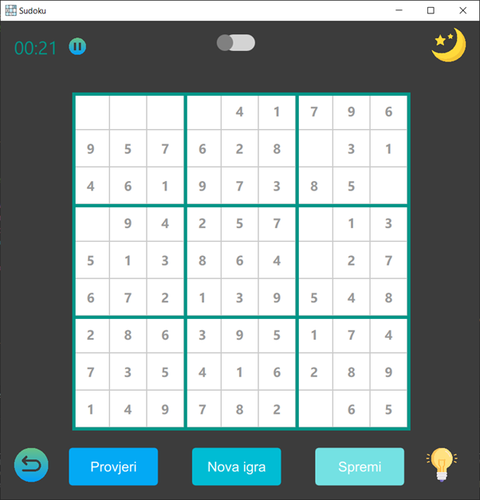

# Sudoku
C++ QML application for University courses:
- Cross platform programming
- Technical application programming

## Content
- [Sudoku](#sudoku)
  - [Content](#content)
- [Implemented features](#implemented-features)
- [Design](#design)

# Implemented features
- Sudoku gameplay
- Generating sudoku grids based on the chosen difficulty level
- Getting hints - one empty cell is being filled
- Timer with play/pause functionality - playing is not available when the game is paused
- Changing the theme into light/dark
- New game
- Save game

# Design

